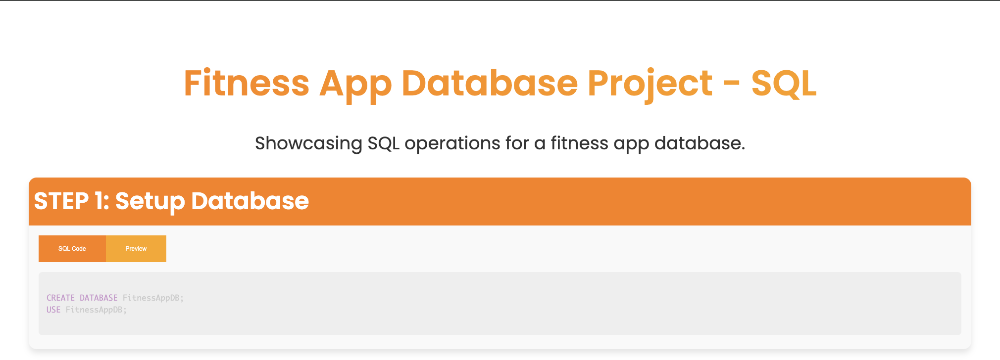
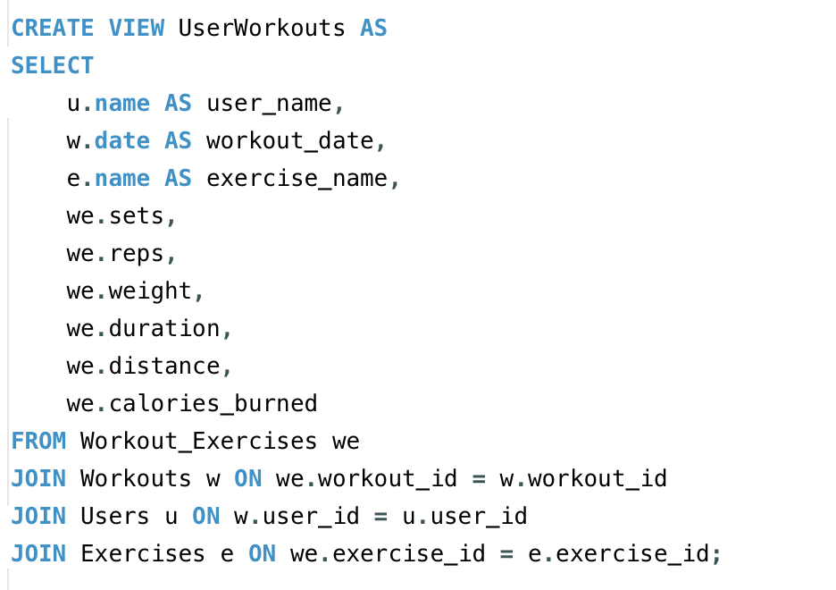
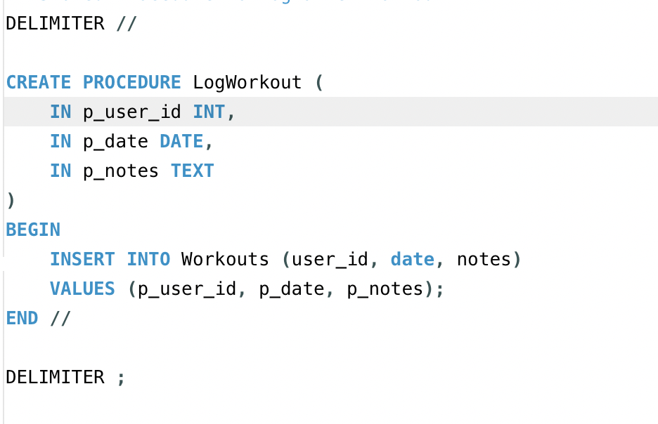
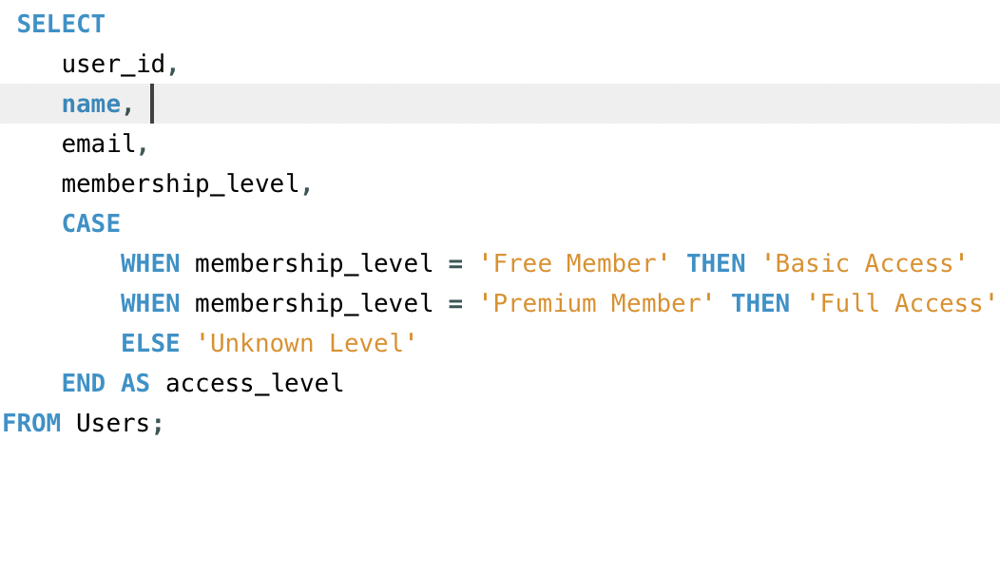

# Fitness Database 🏋️‍♂️📊

# ScreenShot

# Overview
The Fitness Database is a structured relational database designed to support a comprehensive fitness application. It allows users to track their workouts, exercises, nutrition, goals, and achievements. The database is built using MySQL and includes various tables that store information related to users, workouts, exercises, nutrition, goals, and achievements, providing a robust backend for fitness tracking and management.

# Features
- User Management: Store user information, including name, email, password, and membership level.
- Workout Tracking: Log workouts with details such as date, exercises performed, sets, reps, weight, duration, and calories burned.
- Exercise Database: Maintain a list of exercises with types and detailed descriptions.
- Nutrition Logging: Track users' daily meals, calories, and macronutrients.
- Goal Setting: Users can set, track, and update fitness goals over time.
- Achievements: Log milestones and achievements to motivate and track progress.
- Dynamic Relationships: Foreign key relationships ensure data integrity and enable cascading updates and deletions.
- Stored Procedures & Views: Includes stored procedures for logging workouts and views to display user-specific workout data.
- CASE Statements: Categorize users based on their membership levels for different access permissions.

# Database Schema
The database consists of the following tables:

# Users

- user_id (Primary Key)
- name
- email
- password
- membership_level

# Workouts

- workout_id (Primary Key)
- user_id (Foreign Key)
- date
- notes

# Exercises

- exercise_id (Primary Key)
- name
- type
- details

# Workout_Exercises

- workout_exercise_id (Primary Key)
- workout_id (Foreign Key)
- exercise_id (Foreign Key)
- sets
- reps
- weight
- duration
- distance
- calories_burned
- notes

# Nutrition

- nutrition_id (Primary Key)
- user_id (Foreign Key)
- date
- meal_type
- food_items
- calories
- macronutrients

# Goals

- goal_id (Primary Key)
- user_id (Foreign Key)
- goal_description
- target_value
- current_value
- start_date
- target_date

# Achievements

- achievement_id (Primary Key)
- user_id (Foreign Key)
- achievement_description
- date_achieved

# Example Queries
  Here are some example queries that can be executed on this database:

# List All Users:

# List All Workouts:

# View User Workouts and Exercises:

# Log a New Workout (Stored Procedure):

# Categorize Users by Membership Level (CASE Statement):

The SQL script also includes sample data insertion for users, workouts, exercises, and more.

